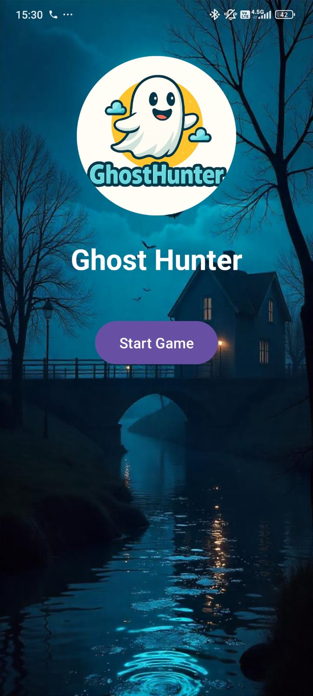
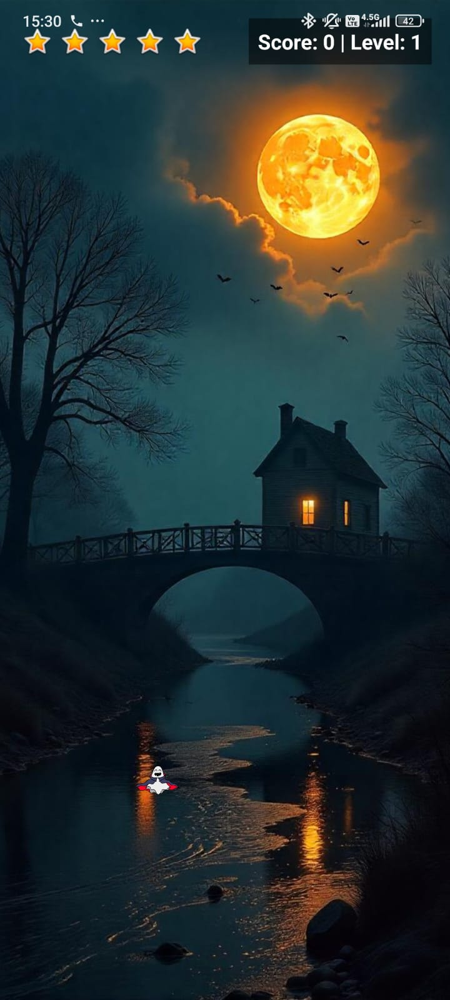
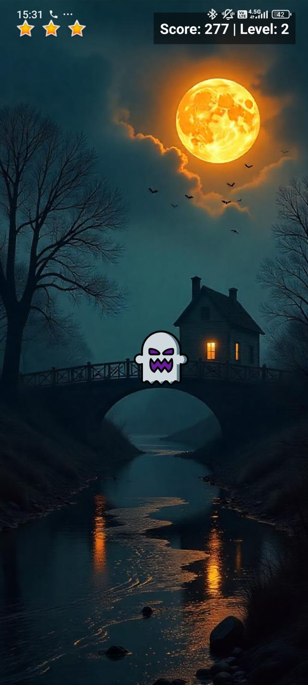
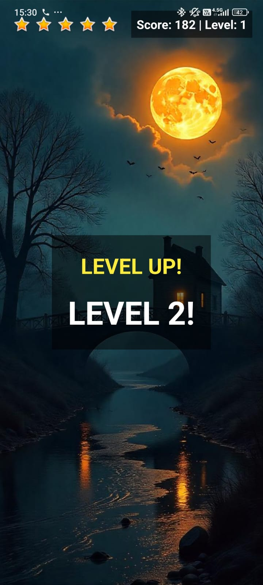
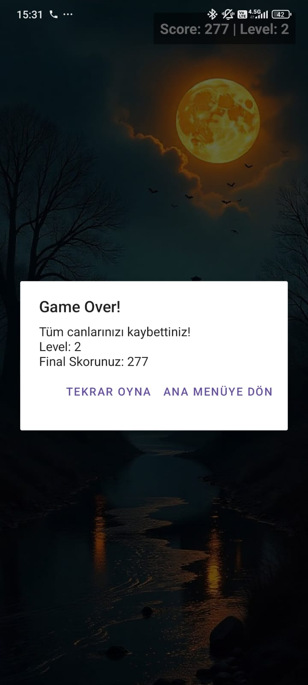

# 👻 Ghost Hunter

## 📌 Proje Başlığı ve Açıklaması

**Ghost Hunter**, özellikle **6-9 yaş arası çocuklar** ve **yaşlı bireyler** için tasarlanmış, eğlenceli ve refleks geliştirmeye yönelik bir mobil oyun uygulamasıdır. Oyuncular, ekranda rastgele beliren hayaletlere zamanında dokunarak onları "avlamaya" çalışır. Kaçırılan her hayalet can kaybına neden olur. Oyuncular 5 canla başlar ve her 5 hayalet öldürüldüğünde bir sonraki seviyeye geçer. Oyun ilerledikçe zorluk seviyesi artar, birden fazla hayalet aynı anda belirir ve hızları artar.

### 🎯 Projenin Amacı
- Mobil oyun geliştirme sürecini deneyimlemek
- Basit ama bağımlılık yapıcı bir oyun mekaniği oluşturmak
- Yaş gruplarına uygun eğlenceli bir arayüz sunmak

### 👥 Hedef Kitle
- 6-9 yaş arası çocuklar  
- Yaşlı kullanıcılar (basit arayüz, yüksek kontrast, kolay oynanış)

### 🧰 Kullanılan Teknolojiler ve Framework'ler
- **Java** (programlama dili)
- **Android Studio** (IDE)
- **XML** (arayüz tasarımı)
- **2D Sprite** görselleri
- **MediaPlayer** ile ses efektleri ve müzikler

---

## 🛠️ Kurulum Rehberi

### 💻 Gerekli Yazılımlar ve Versiyonlar
- Android Studio Arctic Fox (2020.3.1) veya üzeri
- JDK 17 veya üzeri
- Android SDK 33 veya üzeri
- Android cihaz (fiziksel ya da emülatör)

### 🔧 Adım Adım Kurulum Talimatları
1. Proje kaynak kodlarını bu bağlantıdan indirin:  
   📦 [GhostHunter Kaynak Kodu (ZIP)](https://drive.google.com/file/d/1hSgrEtf9viSybgZsriOznflPY8lVHI3K/view?usp=sharing)

2. Android Studio'da `Open an existing project` seçeneğini kullanarak `ghosthunter/` klasörünü açın.

3. Gradle yapılandırması tamamlandığında sol üstteki **"Run ▶️"** butonuna tıklayarak oyunu çalıştırabilirsiniz.

### 📦 Bağımlılıklar
- AndroidX kütüphaneleri (projeye dahil)
- `MediaPlayer` sınıfı (yerleşik)
- Harici bağımlılık yoktur.

### 👶 Hiç Bilmeyen Biri İçin Açıklama
- Android Studio kurulu olmalı.
- Proje açıldıktan sonra “Run” butonuna basarak emulator veya bağlı Android cihazda oyun çalıştırılır.
- Ya da APK dosyası indirilip Android telefona kurulabilir.

---

## ▶️ Kullanım Talimatları

### 🚀 Uygulamanın Başlatılması
- APK dosyasını buradan indirip telefonunuza kurabilirsiniz:  
  📲 [GhostHunter APK](https://drive.google.com/file/d/1261TXQGQg-HUo4_ZoyC_uo6GKD8FcAsF/view?usp=sharing)

### 🎮 Temel Kullanım Senaryosu
- Ekranda rastgele yerlerde hayaletler çıkar.
- Hayalet küçük başlar, zamanla büyür.
- Hayalete zamanında dokunursanız puan alırsınız.
- 5 hayalet öldürünce seviye atlarsınız.
- Her kaçırılan hayalet için 1 can eksilir (toplam 5 can).
- Her seviyede zorluk artar: daha hızlı hayaletler, aynı anda birden fazla hayalet çıkar.

### 🌟 Önemli Özellikler
- Seviye sistemi (gittikçe zorlaşan oyun)
- Puan ve can sistemi
- Vurma sesi ve arka plan müzikleri
- 2D sprite animasyonları

---

## 🚫 AR Özellikler

Bu projede **gerçek bir AR (Artırılmış Gerçeklik)** teknolojisi kullanılmamaktadır.  
Ancak, oyunculara görsel olarak "hayaletleri gerçek dünyadaymış gibi yakalama" hissi vermek amacıyla **sabit bir arka plan resmi** kullanılmıştır. Kamera erişimi veya ARCore gibi teknolojiler **kullanılmamıştır**.

---

## 🖼️ Ekran Görüntüleri

| Ana Menü | Oyun Başlangıcı | Büyüyen Hayalet | Seviye Atlama | Game Over |
|----------|-----------------|-----------------|----------------|-----------|
|  |  |  |  |  |

> Not: Görselleri `screenshots/` klasörüne eklemeyi unutmayın.

---

## 🌍 Web Sitesi

🎮 Tanıtım sayfamız:  
🔗 [https://ozankislali.github.io/GhostHunter.github.io/](https://ozankislali.github.io/GhostHunter.github.io/)

Site Kodları:
- [index.html](https://github.com/ozankislali/GhostHunter.github.io/blob/main/index.html)  
- [style.css](https://github.com/ozankislali/GhostHunter.github.io/blob/main/style.css)  
- [script.js](https://github.com/ozankislali/GhostHunter.github.io/blob/main/script.js)

---

## 🎬 Proje Tanıtım Videosu

📹 YouTube Sunum Videosu:  
[https://youtu.be/JEvJpFRp_SU](https://youtu.be/JEvJpFRp_SU)

---

## 📋 Proje Yönetimi

🗂️ Trello Panosu:  
[https://trello.com/b/6nLhY9VX/ghosthunter](https://trello.com/b/6nLhY9VX/ghosthunter)

---

## 👥 Takım Üyeleri

| İsim             | Okul No  | Rolü                        |
|------------------|----------|-----------------------------|
| Ozan Kışlalı     | 210541053| Dokümantasyon, Sesler       |
| Zekeriyya Köroğlu| 210541013| Oyun Mekanikleri, Kodlama   |

---

## 📜 Lisans

Bu proje sadece **eğitim ve akademik** amaçlarla geliştirilmiştir. Herhangi bir ticari kullanım söz konusu değildir. Görsel ve işitsel materyaller telif içermeyen kaynaklardan alınmıştır.

